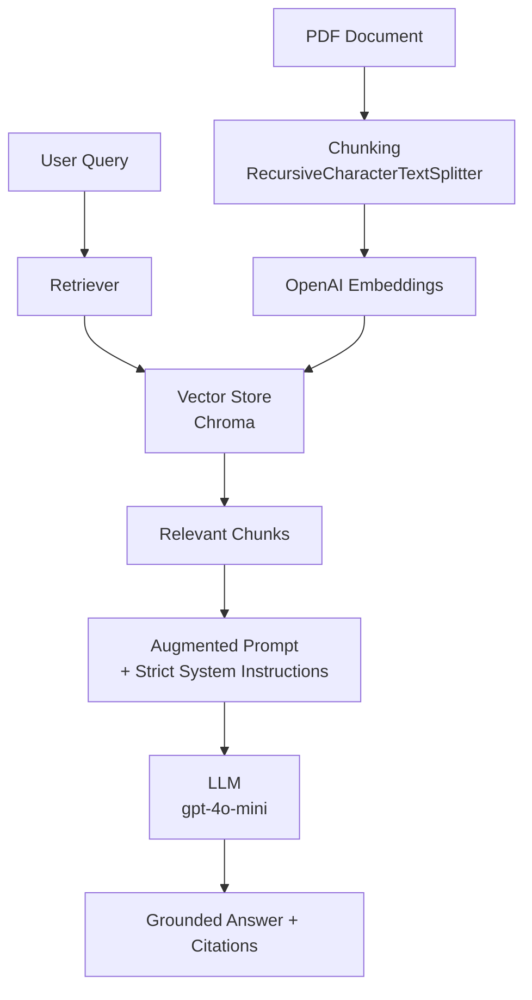

# hbr-apple-leadership-rag

> **Production-grade RAG system** that delivers accurate, source-grounded insights from strategic business documents using LangChain, vector databases, and rigorous evaluation of LLM techniques.

[](https://www.python.org/)
[](https://python.langchain.com/)
[](https://openai.com/)
[](https://streamlit.io/)
[](https://pytest.org/)
[](https://docs.pydantic.dev/)
[](https://www.gnu.org/licenses/gpl-3.0)
[](https://github.com/ivanbbctba)

---

## 🎯 What This Project Demonstrates

A clean, production-ready **Retrieval-Augmented Generation (RAG)** pipeline that extracts precise business insights from dense strategic documents — with measurable improvements in factual accuracy and relevance over raw LLM and prompt-engineering approaches.

**Key Capabilities**
- Systematic three-way comparison: **Raw LLM vs Prompt Engineering vs RAG**
- **Streamlit** dashboard for interactive model comparison
- **Pytest** suite for verifying response engine logic
- **OpenAI API** integration for state-of-the-art generation
- **OpenAIEmbeddings** for high-accuracy RAG retrieval
- Ingests and chunks PDFs with intelligent overlap
- Retrieves contextually relevant passages using embeddings + vector search
- Generates grounded answers with source citations

This project showcases end-to-end RAG engineering skills highly valued in AI Engineer and LLM Application Developer roles: document processing, retrieval quality, prompt design, evaluation, and clean production practices.

---

## 📊 Results: Raw LLM vs Prompt Engineering vs RAG

| Question | Raw LLM | Prompt Engineering | **RAG (Ours)** | Winner |
|---------|---------|--------------------|----------------|--------|
| **Q1: Authors & Publisher** | Failed to answer (asked for the article) | Failed to answer (asked for the article) | **Correctly identified** Joel M. Podolny and Morten T. Hansen, published in *Harvard Business Review* | **RAG** |
| **Q2: 3 Leadership Characteristics** | Generic leadership traits (Vision, Communication, Integrity) | Good structure but partially generic | **More aligned** with the article (Deep expertise, Immersion in details, Collaborative debate) | **RAG** |
| **Q3: Apple’s Leadership & Innovation** | Generic Apple examples (iPhone, iPod, MacBook) | Structured but lacked article grounding | **Strongly grounded** in the article with specific examples (Portrait Mode camera, design details, cross-functional innovation) | **RAG** |

**Key Insight**:  
RAG significantly outperformed both Raw LLM and Prompt Engineering, especially on factual and source-specific questions. The retrieval mechanism allowed the model to ground its answers in the actual document, reducing hallucinations and improving relevance.

## 🧠 Conclusion

This project demonstrates the clear advantage of **Retrieval-Augmented Generation (RAG)** over both raw LLM usage and prompt engineering alone when working with dense, factual business documents.

While Prompt Engineering improves structure and tone, it still lacks access to the source material, often leading to generic or hallucinated answers. RAG, by combining strong prompting with relevant retrieved context, produces answers that are more accurate, specific, and grounded in the original article.

The results from the three original questions show that RAG consistently delivered higher quality, source-aligned responses — particularly on factual questions (such as authorship and publication details) and on extracting nuanced concepts from the text.

This project reinforces a key principle in modern LLM application development: **context is king**. Providing the model with the right information at inference time remains one of the most effective ways to improve reliability and reduce hallucinations in production systems.

---

## 🏗️ Architecture



**Core Pipeline**
- **Ingestion**: PyMuPDF → RecursiveCharacterTextSplitter (256 tokens, 25 overlap)
- **Embeddings**: `text-embedding-3-small`
- **Vector Store**: Chroma (persistent)
- **Retriever**: Similarity search (`k=3`)
- **Generation**: `gpt-4o-mini` with strong grounding instructions

---

## ✨ Features & Engineering Highlights

- **Three-Way Comparison**: Systematic evaluation of Raw LLM vs. Prompt Engineering vs. RAG approaches.
- **Production RAG Pipeline**: Robust Retrieval-Augmented Generation built with LangChain.
- **Interactive UI**: Real-time comparison dashboard built with **Streamlit**.
- **Automated Testing**: Comprehensive test suite using **Pytest** for reliability.
- **High-Performance Embeddings**: Integrated **OpenAIEmbeddings** for precise semantic search.
- **Configuration Management**: Type-safe settings via `pydantic-settings` and `.env`.
- **Source Citation**: Automatic grounding and citation of source documents.

---

## 🛠️ Tech Stack

| Layer                | Technology                        |
|----------------------|-----------------------------------|
| Language             | Python 3.12+                      |
| LLM & API            | OpenAI API (`gpt-4o-mini`)        |
| Embeddings           | OpenAI `text-embedding-3-small`   |
| RAG Orchestration    | LangChain                         |
| Vector Database      | Chroma (Persistent)               |
| Testing              | **Pytest**                        |
| User Interface       | **Streamlit**                     |
| PDF Parsing          | PyMuPDF                           |
| Configuration        | pydantic-settings & .env          |
| Package Manager      | pipenv                            |

---

## 🚀 Quick Start (Local)

```bash
git clone https://github.com/ivanbbctba/hbr-apple-leadership-rag.git
cd hbr-apple-leadership-rag

pipenv --python 3.12
pipenv install
pipenv install --dev black ruff pytest mypy pre-commit

cp .env.example .env
# Add your OpenAI API key

# Run the core pipeline
pipenv run python -m hbr_apple_rag.rag_pipeline

# Launch the interactive Streamlit dashboard
pipenv run streamlit run app.py

# Run tests
pipenv run pytest
```

---

## 📁 Project Structure

```
hbr-apple-leadership-rag/
├── app.py                          # Streamlit demo (Phase 1)
├── src/
│   └── hbr_apple_rag/
│       ├── init.py
│       ├── config.py               # Pydantic settings
│       ├── prompts.py              # System prompts + questions
│       ├── response_engine.py      # Core class (Raw / Prompt Eng / RAG)
│       └── rag_pipeline.py         # Document ingestion & vector store
├── data/
│   ├── raw/                        # Source PDFs
│   └── vector_store/               # Persisted Chroma database
├── tests/
│   ├── test_config.py
│   └── test_response_engine.py
├── Pipfile
├── Pipfile.lock
├── .env.example
└── README.md
```

---

## 🗺️ Roadmap

- [x] Professional project structure + pipenv
- [x] Core RAG pipeline with comparison logic
- [x] Interactive Streamlit demo
- [x] Automated test suite with Pytest
- [ ] Docker + docker-compose
- [ ] GitHub Actions (lint, test, security scan)
- [ ] Pre-commit hooks + mypy
- [ ] Enhanced observability & logging
- [ ] Optional multi-agent extensions

---

## 📝 License

GPL-3.0 — see [LICENSE](LICENSE) for details.

---

## 🙏 Acknowledgments

Harvard Business Review article: *"How Apple Is Organized for Innovation"* by Joel M. Podolny and Morten T. Hansen.  
Developed as part of the Postgraduate Program in Agentic AI for Business at UT Austin McCombs School of Business.

---

**Built by Ivan Beira** — Portfolio project demonstrating production-grade RAG engineering and business insight extraction.