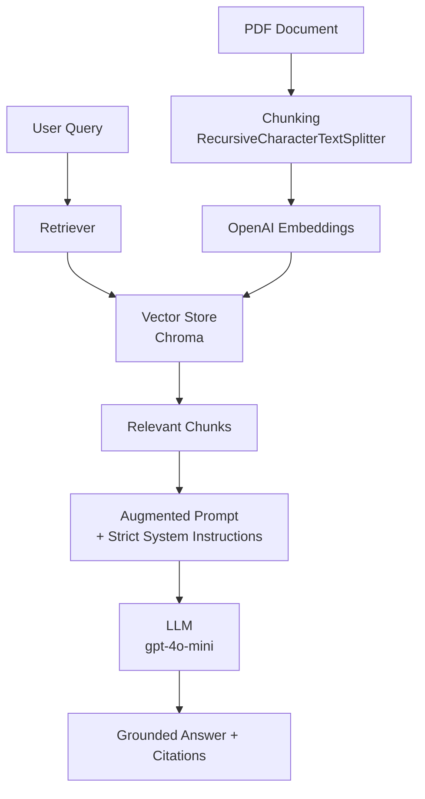

# hbr-apple-leadership-rag

> **Production-grade RAG system** that delivers accurate, source-grounded insights from strategic business documents using LangChain, vector databases, and rigorous evaluation of LLM techniques.

[](https://www.python.org/)
[](https://python.langchain.com/)
[](https://www.gnu.org/licenses/gpl-3.0)
[](https://github.com/ivanbbctba)

---

## 🎯 What This Project Demonstrates

A clean, production-ready **Retrieval-Augmented Generation (RAG)** pipeline that extracts precise business insights from dense strategic documents — with measurable improvements in factual accuracy and relevance over raw LLM and prompt-engineering approaches.

**Key Capabilities**
- Ingests and chunks PDFs with intelligent overlap
- Retrieves contextually relevant passages using embeddings + vector search
- Generates grounded answers with source citations
- Systematically compares three approaches: **Raw LLM vs Prompt Engineering vs RAG**

This project showcases end-to-end RAG engineering skills highly valued in AI Engineer and LLM Application Developer roles: document processing, retrieval quality, prompt design, evaluation, and clean production practices.

---

## 📊 Results: Raw LLM vs Prompt Engineering vs RAG

| Question | Raw LLM                                           | Prompt Engineering                    | **RAG**                                                                                                  |
|---------|---------------------------------------------------|---------------------------------------|----------------------------------------------------------------------------------------------------------|
| **Authors & Publisher** | ? | ? | ?  |
| **3 Leadership Characteristics** | ? | ? | ?  |
| **Apple’s Leadership & Innovation** | ? | ? | ?  |

**Conclusion**: 

---

## 🏗️ Architecture



**Core Pipeline**
- **Ingestion**: PyMuPDF → RecursiveCharacterTextSplitter (256 tokens, 25 overlap)
- **Embeddings**: `text-embedding-3-small`
- **Vector Store**: Chroma (persistent)
- **Retriever**: Similarity search (`k=3`)
- **Generation**: `gpt-4o-mini` with strong grounding instructions

---

## ✨ Features & Engineering Highlights

- Modern `src/` layout with proper Python packaging
- Reproducible RAG pipeline built with LangChain
- Strong system prompting for business/strategic analysis
- Automatic source citation in every response
- Systematic three-way evaluation framework
- Configuration via `pydantic-settings` + `.env`
- Ready for Streamlit/Gradio demo, Docker, and CI/CD

---

## 🛠️ Tech Stack

| Layer                | Technology                        |
|----------------------|-----------------------------------|
| Language             | Python 3.12+                      |
| Package Manager      | pipenv                            |
| LLM                  | OpenAI `gpt-4o-mini`              |
| Embeddings           | OpenAI `text-embedding-3-small`   |
| Orchestration        | LangChain                         |
| Vector Database      | Chroma                            |
| PDF Parsing          | PyMuPDF                           |
| Configuration        | pydantic-settings                 |
| Future / Demo        | Streamlit, Docker, GitHub Actions |

---

## 🚀 Quick Start (Local)

```bash
git clone https://github.com/ivanbbctba/hbr-apple-leadership-rag.git
cd hbr-apple-leadership-rag

pipenv --python 3.12
pipenv install
pipenv install --dev black ruff pytest mypy pre-commit

cp .env.example .env
# Add your OpenAI API key

pipenv run python -m src.hbr_apple_rag.rag_pipeline
```

---

## 📁 Project Structure

```
hbr-apple-leadership-rag/
├── src/
│   └── hbr_apple_rag/          # Core package
│       ├── config.py
│       ├── rag_pipeline.py
│       └── utils.py
├── data/
│   └── raw/                    # Source documents
├── notebooks/                  # Exploration & analysis
├── tests/                      # Test suite
├── .github/workflows/          # CI/CD (planned)
├── Pipfile
├── Pipfile.lock
├── .env.example
└── README.md
```

---

## 🗺️ Roadmap

- [x] Professional project structure + pipenv
- [ ] Core RAG pipeline with evaluation
- [ ] Streamlit interactive demo
- [ ] Docker + docker-compose
- [ ] GitHub Actions (lint, test, security scan)
- [ ] Pre-commit hooks + mypy
- [ ] Enhanced observability & logging
- [ ] Optional multi-agent extensions

---

## 📝 License

GPL-3.0 — see [LICENSE](LICENSE) for details.

---

## 🙏 Acknowledgments

Harvard Business Review article: *"How Apple Is Organized for Innovation"* by Joel M. Podolny and Morten T. Hansen.  
Developed as part of the Postgraduate Program in Agentic AI for Business at UT Austin McCombs School of Business.

---

**Built by Ivan Beira** — Portfolio project demonstrating production-grade RAG engineering and business insight extraction.